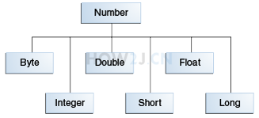

#### 封装类

所有的**基本类型**，都有对应的**类类型**
比如int对应的类是Integer
这种类就叫做**封装类**

```java
public class TestNumber {
    public static void main(String[] args) {
        int i = 5;
        //把一个基本类型的变量,转换为Integer对象
        Integer it = new Integer(i);
        //把一个Integer对象，转换为一个基本类型的int
        int i2 = it.intValue();    
    }
}
```

##### number

数字封装类有
Byte,Short,Integer,Long,Float,Double
这些类都是抽象类Number的子类



```java
public class TestNumber {
    public static void main(String[] args) {
        int i = 5; 
        Integer it = new Integer(i);
        //Integer是Number的子类，所以打印true
	    System.out.println(it instanceof Number);
    }
}
```

#### 封装类转基本类型

```java
public class TestNumber {
    public static void main(String[] args) {
        int i = 5;
        //基本类型转换成封装类型
        Integer it = new Integer(i);
        //封装类型转换成基本类型
        int i2 = it.intValue();        
    }
}
```

#### 自动装箱

不需要调用构造方法，**通过=符号** **自动**把 基本类型 转换为 类类型 就叫装箱

```java
public class TestNumber {
    public static void main(String[] args) {
        int i = 5;
        //基本类型转换成封装类型
        Integer it = new Integer(i);
        //自动转换就叫装箱
        Integer it2 = i;        
    }
}
```

#### 自动拆箱

不需要调用`Integer`的`intValue`方法，通过`=`就自动转换成`int`类型，就叫拆箱

```java
public class TestNumber {
    public static void main(String[] args) {
        int i = 5;
        Integer it = new Integer(i);
        //封装类型转换成基本类型
        int i2 = it.intValue(); 
        //自动转换就叫拆箱
        int i3 = it;  
    }
}
```

#### 最值

`int`的最大值可以通过其对应的封装类`Integer.MAX_VALUE`获取

```java
public class TestNumber {
    public static void main(String[] args) {
        //int的最大值
        System.out.println(Integer.MAX_VALUE);
        //int的最小值      
        System.out.println(Integer.MIN_VALUE);         
    }
}
```

